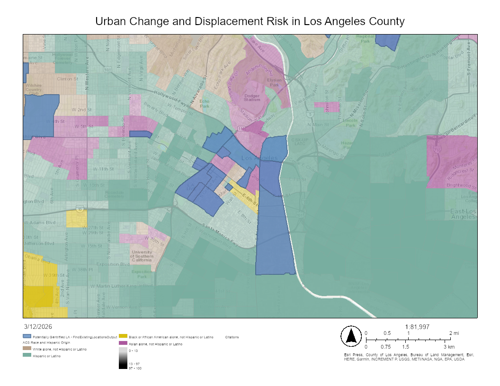
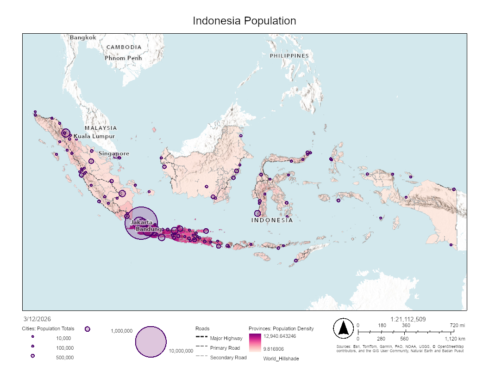
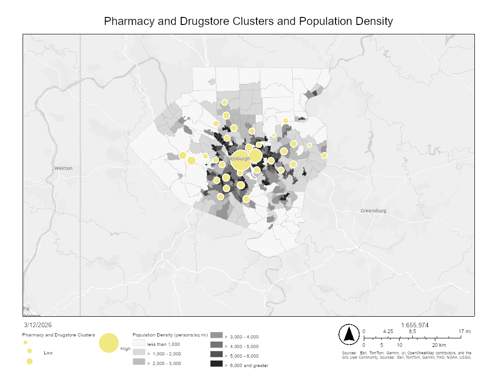
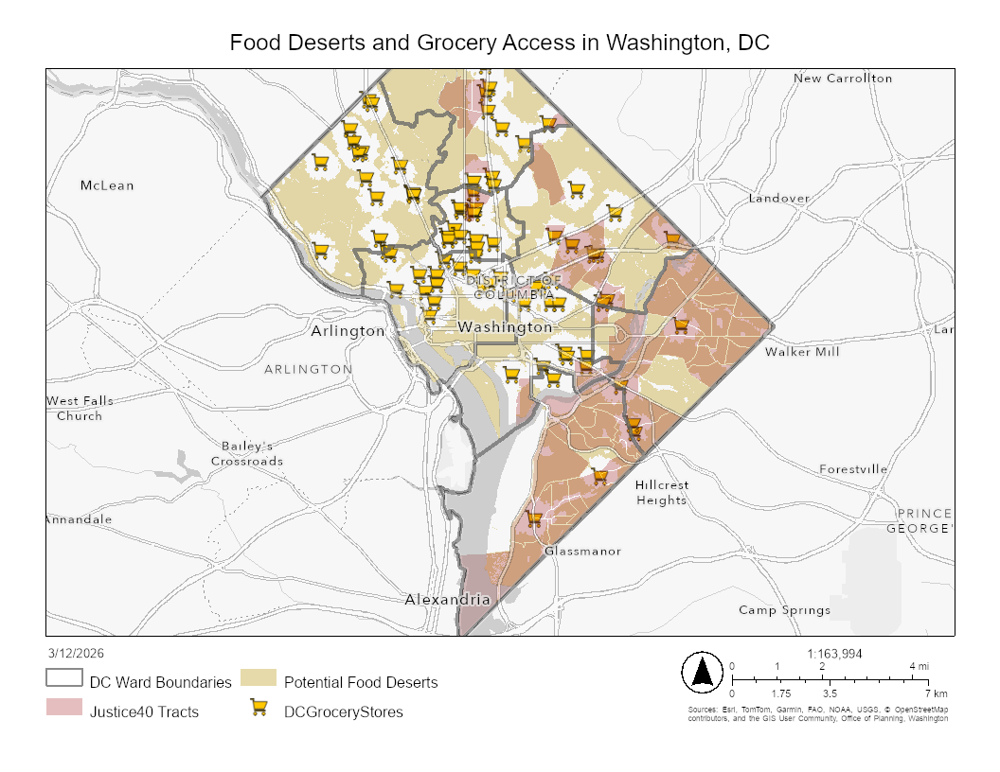

# **<u>GIS Projects</u>**

## [Asthma Cases in the Gateway Cities](https://storymaps.arcgis.com/stories/e731fa8365ba41df8beb111e466a89c2)

## [Urban Change and Displacement Risk in Los Angeles County](https://csulb.maps.arcgis.com/home/item.html?id=7c98ee63b75f4e469d757eb2feaa6f3d)

## [Indonesia Population](https://csulb.maps.arcgis.com/home/item.html?id=5654034b6ef84dbfa232c4a01a60f504)

## [Pharmacy and Drugstore Clusters and Population Comparison](https://csulb.maps.arcgis.com/home/item.html?id=8779e3350ca449a2a862ea65dfba1bf1)

## **Food Deserts and Grocery Access in Washington D.C.**

